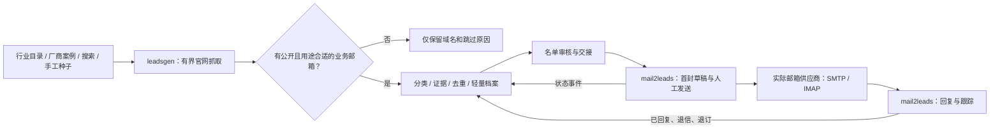

# leadsgen 第一版系统设计

日期：2026-09-23。状态：设计草案与界面原型；不是已经上线的能力。

更新：后续实现与当前边界见 [v0.2 上线说明](release-v0.2.md)。用户已明确纳入纯机房租赁公司及公开销售、客服邮箱，并要求首封后第 7、14、28、60、90 天跟进。发送执行归 mail2leads。

## 1. 目标和系统边界

目标是持续产生“公司身份可追溯、有公开业务邮箱、值得联系”的轻量客户档案，为 Glocal Storage 的 Supermicro 整机、其他品牌整机及 CPU / HDD / DRAM / SSD / 网卡业务建立客户入口。

leadsgen = 客户发现与建档系统。mail2leads = 邮件会话与后续跟踪系统。mail.storage.cn = 用户提供的邮箱入口，不能直接当作已验证的 SMTP 或 API 地址。

本仓库不实现 SMTP 发送、自动催信、收件箱、报价、订单、销售阶段 CRM。为避免重复开发，名单交接后的页面只显示邮件系统状态及跳转链接。客户回复后的深度研究不是本版功能；后续可以接收独立的研究请求，不能默认全网深挖每个客户。

## 2. 已核实的现状

- 可访问官网为 https://www.glocalstorage.com/，用户消息中的 `glocaltorage.com` 少一个 `s`。官网展示 Supermicro 整机、数据中心配件，以及开盒新品和二手翻新产品。
- 本地 `~/code/mail2leads` 已有 IMAP 收信、邮件归线程、SMTP 回复、一次性发送令牌及线索只读接口。当前发送 API 绑定已有 `thread_id`，没有面向外部名单的首封开发信入口。
- `mail2leads/docs/production-pilot.md` 记录过 `sales@glocalstorage.com` / 网易邮箱的试点。这可作为发件账户候选，不能据此认定当前正式服务已接通。
- 当前环境访问 `https://mail.storage.cn` 未成功。尚未核实此入口对应的账户、SMTP 主机、端口、供应商政策及 Sent 文件夹。
- mail2leads 自身文档仍列有生产认证和权限方面的未完成项；本方案不把本地源码能力等同于生产可用。

本次仅阅读相关代码和公开页面，没有修改 mail2leads，也没有登录或发送邮件。

## 3. 客户分类：价值分层、经营类型、证据分别存

Tier 表示业务优先级，经营类型说明怎么买卖；不能用一个字段代替全部事实。

| 分层 | 定义 | 典型对象 |
| --- | --- | --- |
| Tier 1A | 有可信 Supermicro 使用证据的最终运营/使用方 | GPU 云、托管独立服务器商、区域 CSP、自营服务器集群 |
| Tier 1B | 确实运营或采购整机，但品牌使用情况未证实 | 企业 IT、金融、电信、国企央企、科研算力、其他品牌用户 |
| Tier 1C | 以完整项目、集成和服务采购为主的方案商 | 行业 SI、解决方案交付商；明确记录为 `solution_integrator`，不写成最终用户 |
| Tier 1D | 机房租赁与托管公司，即使不直接采购整机也纳入 | Colocation、机柜/空间出租；实际采购角色独立核验 |
| Tier 2A | Supermicro 或多品牌整机的转售渠道 | VAR、服务器经销商、批发商 |
| Tier 2B | 数据中心配件和备件贸易商 | CPU、企业级 HDD / SSD、DRAM、NIC 贸易商 |

`business_model` 独立取值 `end_user / solution_integrator / reseller / mixed / unknown`；`tier_reason` 保存分类依据。混合业务保留多个业务标签，并按目标采购场景确定主分类。未知类型进入待核验，不强行分层。

Supermicro 证据独立取值：`confirmed_use / confirmed_resale / probable / unknown`。只有客户官网技术页面、可靠厂商案例、采购公告等能够证明使用；售卖 Supermicro 的产品页只能证明转售。历史案例保留发布日期，不能当成当前采购意向。厂商案例中的厂商 PR 邮箱不能登记为案例客户的邮箱。

独立记录 `products_of_interest`（整机、GPU 服务器、存储服务器、CPU、HDD、DRAM、SSD、NIC 等）和 `condition_interest`（新品、开盒、翻新、未知）。只写来源支持的事实；“我们能卖什么”不等于“客户现在要买什么”。

### 第一批更值得做的对象

先找有基础设施、硬件使用证据及业务联系方式的区域云、GPU 云、裸金属和独立服务器服务商。大型 hyperscaler 保留战略账户标签，但不能仅因规模大就排在有实际采购入口的客户前面。纯机房托管、房地产式数据中心、仅代理公有云服务的公司，不因名称含 data center/cloud 就认定是整机买家。

### 地理与排序

业务区域顺序：美国 → 欧洲 → 中国 → 东南亚 → 其他。默认先看 Tier 1，Tier 1 内按此地域顺序；Tier 2 独立视图按相同顺序。可切换地区工作队列。

存储 ISO 国家/地区代码、国家/地区显示名、总部所在地、目标采购实体所在地、城市、语言与时区。业务区域是独立的可配置映射；英国、瑞士等归欧洲但不等于欧盟。国家不确定就留空，不能凭 `.com`、服务器 IP 或网站语言猜测。跨国集团保留母子公司和采购实体关系，不能把总部国家复制给所有分公司。

排序建议：`tier → region_rank → sub_tier → contact_quality → fit_score → evidence_freshness`。fit_score 是解释性规则分，不是成交概率：硬件匹配 35、采购模式证据 25、联系人相关性 25、信息新鲜度 15；缺失项不得给满分。每一项展示理由。地区和 Tier 不重复藏入评分。

## 4. 采集流程与成本控制

### A. 定向发现网站

每个采集计划保存地区、国家、Tier、行业、产品、查询语言、种子来源、域名预算和版本。

来源优先级：Supermicro 官方客户案例 → 客户官网引用或技术文档 → 行业协会/展商/服务商目录 → 搜索 API → 手工导入官网。Tier 2 可以从官方渠道目录发现，但再次核验官网。

查询样例：`"Supermicro" "bare metal" "contact"`、`"GPU cloud" "Supermicro"`、`"dedicated servers" "hardware"`、`超微 服务器 云服务 联系我们`。按国家与本地语言分拆任务。搜索结果只用于发现 URL，不直接成为客户事实或邮箱证据。不采集登录后联系人平台，也不购买来路不明的邮箱表。

搜索适配器独立配置，支持手动种子作为无供应商依赖的起点。每次查询记录成本、来源和结果数；生产启用付费搜索前选定供应商与预算。

### B. 先找公开邮箱，再补轻量资料

1. 规范化官网域名，查历史任务与排除名单，避免重复抓取。
2. 读取 robots.txt 和首页，发现 Contact / About / Legal / Solutions 等有用链接。
3. 首轮只抓首页及 2 个最可能的联系页；找到合适公开邮箱后，才补公司信息和硬件证据。单公司默认总上限 8 页、90 秒、5 MB/页；最多 1 个与业务直接相关的小 PDF，默认不做 OCR。
4. 普通 HTTP 优先；关键联系页依赖 JS 时，仅对该页启用浏览器渲染，受同一预算限制。读取页面展示的邮箱或 `mailto:`，支持明确的 `(at)` / `(dot)` 写法。
5. 最多 2 层、单域并发 1、域内间隔初值 3 秒；服从更严格的站点限制。403/验证码停止，429 遵循 Retry-After，临时网络错误有限退避。不会绕过登录、验证码或禁止采集。
6. 预算耗尽或未找到合适邮箱，记录 `no_public_business_email / blocked / timeout / uncertain_identity` 等原因，退出。30 天后可重试；这只是可调初值。

“没有邮箱就不抓”落地为：为判断是否有邮箱，允许做最小限度页面读取；没有邮箱不建立正式客户档案、不保存深度画像。只保留 domain、检查时间、原因、下次可查时间等轻量任务记录，避免每次重新浪费资源。

爬虫只访问公网 HTTP(S)。校验 DNS 解析及每次重定向，拦截 loopback、私网、链路本地、metadata 等地址，限制内容大小、超时和解压尺寸；公司官网也可能含不可信链接。网页内容与 PDF 中的文字是数据，不能指挥系统调用工具或更改任务规则。

### C. 公开邮箱与“可达”不是同一件事

- 必须有公开来源页面、原文片段和采集时间，不猜姓名邮箱、不根据域名生成 `sales@`。
- 语法与 DNS 检查只证明地址形式和域名邮件路由有条件可用，不能保证某个收件箱存在或一定收到。MX 缺失时区分 Null MX、DNS 临时错误和隐式 MX 情况，不能把所有缺失一概判成无效。依据：[RFC 5321 §5.1](https://www.rfc-editor.org/rfc/rfc5321#section-5.1)、[RFC 7505](https://www.rfc-editor.org/rfc/rfc7505)。
- 不通过探测式 SMTP 验证或群发测试信来确认邮箱。实际投递接受、退信和回复由邮件系统回传。
- 优先顺序：采购 / 供应商引入 / 基础设施负责人 → 合作渠道 → 通用商务邮箱。`sales@` 是业务入口，但通常是对方销售部门，标记为路由待确认，不假装采购联系人。
- 公开 `sales@`、`support@` 和通用联系邮箱均可作为首封入口。没有采购联系人时仍保留并交接，不把邮箱用途当作客户资格。`abuse@`、隐私、法务、招聘和 `noreply@` 不作为业务联系入口。
- 个人姓名仅在明确的企业业务联系场景中摘录。公开的个人邮箱需人工核验其业务用途。邮箱域不同于官网时保留证据，不能自动归属；公共邮箱域不能用于公司合并。

技术检查、业务相关性、发送资格分别记录。公开邮箱本身不代表同意营销。首版在交接处记录地区适用规则、处理依据/复核状态和排除名单；尚未复核的名单可以建档，不能显示为可发送。美国、欧洲各国、英国、中国和东南亚国家不能套用一个规则。具体发送限制由 mail2leads 的发送政策执行。

### D. 提取与去重

确定性提取先处理邮箱、电话、链接和结构化数据；模型仅在必要时做行业/经营类型分类及一句话摘要，输出严格结构、来源引用、任务和模型版本。无法支持的字段留空，不填写编造的职位、法人名称、电话或品牌使用情况。

以注册域、规范化名称、已知别名及法定实体共同识别公司；域名匹配只提出合并候选，不把集团子公司直接合并。跨站共享邮箱进入人工复核。邮箱保留原始大小写，域名标准化，并使用保守的比较键去重；不对企业邮箱全局删除 `+tag` 或点号。

每个公司可有多个联系方式，但首轮只选择一个最合适的收件地址。缺少电话或联系人姓名不会阻止建档；缺少可信公开业务邮箱会阻止。

## 5. 客户档案与数据表

| 对象 | 核心字段 | 说明 |
| --- | --- | --- |
| Company | id、展示名、公开公司全名、legal_name_verified、官网、注册域、母公司/采购实体 | 全名找不到时标记“待核实”，不把品牌名冒充法人名 |
| Classification | Tier/子层、经营类型、行业、产品、Supermicro 证据级别、理由、规则版本 | 推断与事实区分，支持人工修正并留记录 |
| Geography | 总部国家、目标采购国家/地区、业务区域、城市、语言、时区 | 未知不猜测 |
| Contact | 姓名/部门、职位、公开邮箱、电话、用途、主联系人标记 | 姓名/电话可空；通用邮箱姓名显示“未公开” |
| Evidence | 字段、URL、摘录、抓取/发布日期、内容哈希、提取器或模型版本 | 每个关键事实可点开来源；不默认长期存全站 |
| EmailCheck | syntax、DNS 状态、public_source、role、checked_at、失败原因 | DNS 检查不叫“已验证收件箱” |
| CrawlJob / Candidate | 种子、配方、预算、阶段、检查时间、失败/跳过原因 | 无邮箱只在轻量候选记录中保留 |
| Handoff / Outbox | lead_id、contact_id、外部账户、幂等键、交接版本、接收回执、重试 | 本地事务提交档案与待交接事件 |
| OutreachEvent | 外部 message/thread id、状态、事件 id、时间、来源 | 只读邮件系统状态镜像 |
| Suppression | 地址或公司/域、范围、原因、来源、时间 | 退订/拒绝/硬退信优先于重新发现 |

“潜客”不等于询盘商机。交接时不能把静态采集档案直接写进 mail2leads 的人工确认商机表。联系人详情只保留最小必要信息；真实数据置于私有数据目录，定期检查过期、修正及删除需求，排除记录保留最小必要键以防再次联系。

档案状态：`待核验 → 可交接 → 待交接 → 已交接`，收到邮件系统的接收回执才标记“已交接”，另有 `已排除 / 待更新`。邮件状态独立：`未发起 / 待审核 / 排队 / SMTP已接受 / 发送结果待核对 / 退信 / 已回复 / 已退订`。一个字段不能同时承担采集进度和邮件结果。

## 6. 首封邮件如何走 mail.storage.cn

推荐路径：leadsgen 选择名单 → mail2leads 接收外部潜客并创建首封草稿 → 用户在 mail2leads 确认模板、发件账户、收件人及正文 → 使用该账户真实 SMTP/供应商发送接口逐封发送 → IMAP 同步回复。

网页登录域名不等于 SMTP 主机，也不说明发件地址。后续配置应在 mail2leads 完成，核实 SMTP/IMAP 地址、TLS、授权凭据、发件身份、供应商发信限制、Sent 同步，以及 SPF/DKIM/DMARC。leadsgen 不存邮箱密码。

标准邮件稍后单独准备。本版仅预留模板 ID、语言、版本和少量变量，不自动生成没有根据的采购需求或联系人称呼。首封一家公司一个地址、一封独立邮件，不把不同客户放在同一 To/CC/BCC。发送节奏服从供应商额度和账号实际投递表现；不能用一个任意“每日封数”宣称安全。

接口未接通之前，可以审核后导出名单供人工处理，但“已导出”只能表示导出，不能表示 mail2leads 已收到或已经发送。通过网页邮箱人工发送后若无 Sent 对账，记录为“人工记录，未核对”，避免以后重复。

### 如何准确知道谁已经发过

mail2leads 是邮件事实唯一来源。它需要新增首封发送账本、外部潜客 ID 映射和事件回传，leadsgen 才显示真实状态。拟议协议详见 [handoff-v1.md](handoff-v1.md)。

- 发送前为“发件组织 + 客户采购实体 + first_touch”建立唯一约束，并对规范化邮箱另做去重。换模板、换批次或再次爬取不能重置首封状态。需再次联系时走邮件系统明确的后续动作。
- 草稿先持久化确切收件人、正文哈希、模板版本和 Message-ID，再进入发送；按钮双击、网络重试不能创建新发送。
- SMTP 接受仅显示“SMTP 已接受”，不承诺送达收件箱。传输成功但本地记录失败属于“不确定”，先对账，不能盲目重发。
- webhook 使用事件 ID 去重、签名/时间校验和逐记录版本；配合增量拉取修复漏事件。已退订不能被晚到的“已发送”覆盖。
- 回复优先通过 In-Reply-To / References 关联 Message-ID；无引用时结合地址及线程上下文生成待核对候选，不单凭相同主题或公司域名强行归并。
- 硬退信停止该邮箱；退订/明确拒绝按照申请范围停止地址或公司，重新采集也不能解除。自动回复和不在办公室通知不计为有效销售回复。

发送政策页面需要退订处理和联系人排除功能。美国商业邮件适用 CAN-SPAM 要求；英国 B2B 规则会因法人/个人经营类型而异，不能推广为全欧洲通用许可。这里只确定系统需要保存的状态，逐国家实际发送政策在接通前配置。

## 7. Ant Design 界面

默认首页直接进入“客户档案”，以表格工作流为中心。使用真正的 Ant Design React 组件与统一主题 token；不自画一套外观接近但交互不一致的组件。

布局：固定侧栏、轻量顶栏、页面标题/主要操作、四项简明计数、视图 Tabs、筛选栏、Table、详情 Drawer。浅色背景、白色内容区域、蓝色主操作、低饱和状态色。字体和间距统一；状态同时有文字，不依靠颜色辨认。

| 页面 | 主要内容与操作 |
| --- | --- |
| 客户档案 | 公司/国家/行业/Tier/证据/公开邮箱/交接状态；搜索、地区与国家筛选、选中交接 |
| 采集计划 | 国家×行业×类型配方、来源、预算、任务结果、无邮箱原因；新增/暂停计划 |
| 交接记录 | 名单、接收回执、邮件状态、重复保护、邮件线程链接；不出现发送邮件编辑器 |
| 分类规则 | 地区顺序、客户定义、邮箱用途、证据要求；配置变更可追溯 |

详情抽屉显示：一句话介绍、公司身份、分类依据、联系方式、字段来源和邮件事件。筛选条件保持不丢失。批量交接前展示合格数量与被排除原因；禁止把审核中、已交接、退订客户混入名单。生产页还需要 loading、空结果、采集失败、同步过期与权限不足状态，不能失败后切回假数据。

当前原型使用合成公司及 `.example` 地址，显著标记“设计预览”。可以操作筛选、详情、选择客户、预览交接和创建演示采集计划；操作只在内存生效。它不是实际数据产品。

## 8. 技术和部署建议

前端采用 React + TypeScript + Ant Design + Vite。后端建议 Python + FastAPI；静态网页 httpx + HTML 解析，必要时 Playwright。SQLite WAL 起步，独立有界 worker 与数据库任务表处理低并发、重试与恢复；连接超时、短事务和 writer 竞争需要测试。多人并发和任务量增长后换 PostgreSQL 与独立队列，而非第一天引入复杂集群。

后端按 discovery / fetch / extraction / classification / contacts / handoff 分模块；搜索、模型和邮件交接均为适配器。规则逻辑和关键门槛由代码执行，模型只提出有证据的分类建议。模型不可用时保留已提取事实、显示待分类，不编默认结果。

源码位于 `~/code/leadsgen`。运行库、受控证据和导出位于 `~/.local/share/leadsgen/`；日志 `~/.local/state/leadsgen/`；凭据 `~/.config/leadsgen/`。本地先仅监听回环地址；多人访问时接现有可靠身份系统，限制名单导出和审核权限，再开放内网/生产访问。独立数据库备份必须验证恢复。

## 9. 实施顺序与验收

1. **本次：设计 + UI v0.1。** 评审客户分类、表格和邮件边界；所有数据清楚标示为示例。
2. **真实采集 v0.2。** 先手工提供/发现 30 个美国 Tier 1 候选官网，运行有界采集和抽检。30 是采样预算，不保证得到 30 条有效线索。验收来源可追溯率 100%、虚构邮箱 0、无公开业务邮箱不入正式库、重复导入不新增公司/联系人、费用与失败可见。
3. **交接 v0.3。** 在 mail2leads 独立补齐外部潜客导入、首封草稿、发送账本和状态 API。验证重复交接、SMTP 拒绝、发送后掉线、重复/乱序事件、退订再发现、回复关联。对指定测试邮箱验收后再处理实际客户。
4. **区域扩展 v0.4。** 美国样本质量达标后扩展欧洲，再中国、东南亚、其他；按国家分别管理联系规则。迭代来源质量和 Tier 2 配方。

运营指标：发现域名数、完成轻量检查数、公开业务邮箱命中率、合格档案数、Tier 1 占比、有效联系人比例、每条合格档案抓取/模型成本、首封接受数、退信率、有效回复率。每个比例显示分子/分母与时间范围；不以全网抓到邮箱总数作为成功标准。

## 10. 依据

- [Glocal Storage 官网](https://www.glocalstorage.com/)
- [Supermicro 官方客户案例库](https://www.supermicro.com/en/resources?type%5BSuccess+Story%5D=Success+Story)
- [Ant Design React](https://ant.design/docs/react/introduce/)、[主题 Token](https://ant.design/docs/react/customize-theme/)、[Table](https://ant.design/components/table/)
- [FTC：CAN-SPAM 商业指南](https://www.ftc.gov/business-guidance/resources/can-spam-act-compliance-guide-business)
- [ICO：Business-to-business marketing](https://ico.org.uk/for-organisations/direct-marketing-and-privacy-and-electronic-communications/business-to-business-marketing/)
- [Google 邮件发件人指南](https://support.google.com/mail/answer/81126)
- 本地代码检查：`mail2leads/README.md`、`server/src/mail2leads/send/__init__.py`、`server/src/mail2leads/api/app.py`、`docs/production-pilot.md`。这些是当前源码与项目记录，不是线上连接测试。
